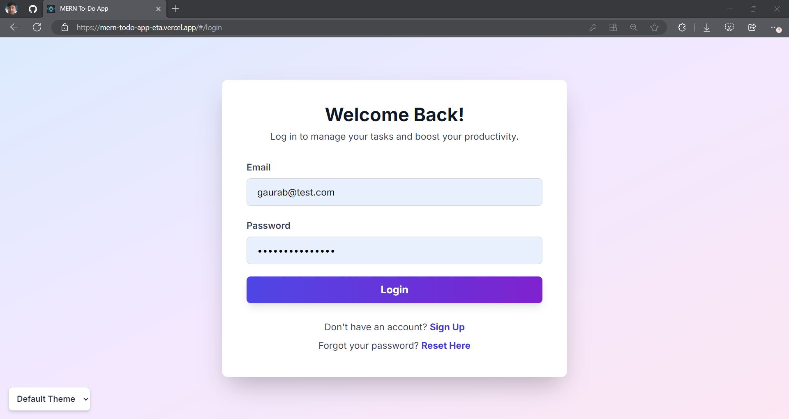
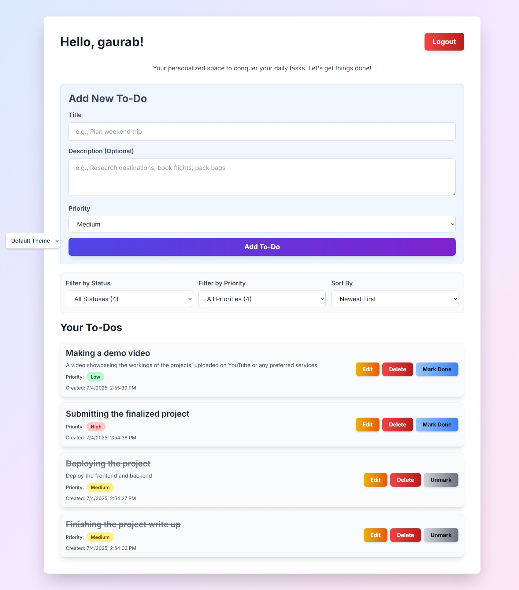
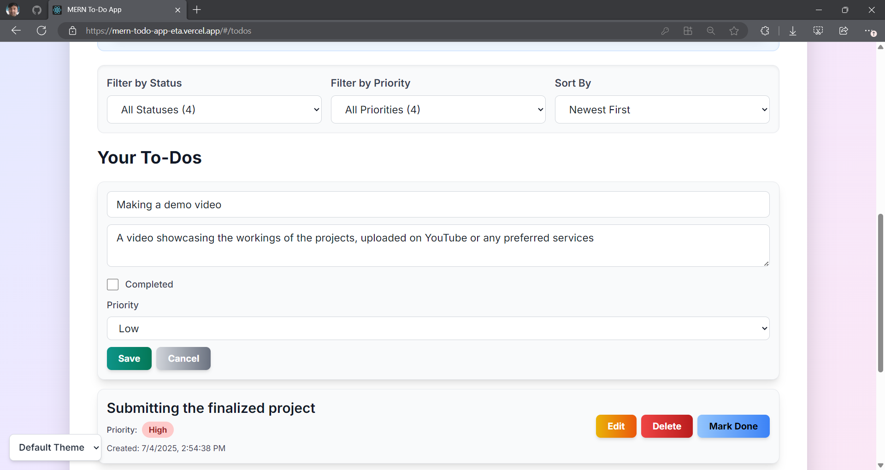

# MERN Todo App

A simple yet effective full-stack web application for managing daily tasks, built using the MERN (MongoDB, Express.js, React.js, Node.js) stack. This application allows users to keep track of their to-do items with ease and offers a clean, responsive user interface.

## Table of Contents

* [Features](#features)
* [Technologies Used](#technologies-used)
* [Project Structure](#project-structure)
* [Getting Started](#getting-started)
  * [Prerequisites](#prerequisites)
  * [Installation](#installation)
  * [Running the Application](#running-the-application)
* [Usage](#usage)
* [Deployment](#deployment)
* [Screenshots](#screenshots)
* [Project Accomplishments](#project-accomplishments)
* [Author](#author)
* [Contributing](#contributing)
* [License](#license)
* [Acknowledgements](#acknowledgements)

## Features

This MERN Todo App provides the following core functionalities:

* **Add New Todos:** Easily create new tasks with titles and descriptions.
* **Edit Existing Todos:** Modify the details of existing to-do items.
* **Delete Todos:** Remove completed or unwanted tasks from the list.
* **Multiple Theme Toggles:** Choose from three different themes to customize the application's appearance.
* **Responsive Design:** A user interface that adapts to various screen sizes, ensuring a consistent experience across devices.

## Technologies Used

The application leverages the power of the MERN stack:

* **MongoDB:** A NoSQL database for storing task data.
* **Express.js:** A fast, unopinionated, minimalist web framework for Node.js, used for building the backend API.
* **React.js:** A JavaScript library for building user interfaces, used for the frontend.
    * **Material-UI:** A popular React UI framework for creating beautiful and responsive designs.
* **Node.js:** A JavaScript runtime environment that executes JavaScript code outside a web browser, used for the backend server.

## Project Structure

The project is structured into two main directories:


MERN-TODO-APP/
├── client/                      # Contains the React frontend application
├── server/                      # Contains the Node.js/Express.js backend API
└── README.md                    # This main project README file


Each of these directories (`client` and `server`) contains its own `node_modules` for dependencies, `package.json` for project metadata, and source code.

## Getting Started

Follow these instructions to get a copy of the project up and running on a local machine for development and testing purposes.

### Prerequisites

Before beginning, ensure the following are installed on the system:

* **Node.js & npm:**
    * Download and install from [nodejs.org](https://nodejs.org/). `npm` (Node Package Manager) is included with Node.js.
* **Git:**
    * Download and install from [git-scm.com](https://git-scm.com/).
* **MongoDB:**
    * Install MongoDB locally or set up a cloud-based instance (e.g., MongoDB Atlas) and obtain the connection URI.

### Installation

1.  **Clone the repository:**

    ```bash
    git clone [https://github.com/KnownTeach616/mern-todo-app.git](https://github.com/KnownTeach616/mern-todo-app.git)
    cd mern-todo-app
    ```

2.  **Checkout the specific commit (if applicable):**

    ```bash
    git checkout ed001306c6f28cfec119018b7865dd5df6df3aae
    ```

3.  **Install backend dependencies:**

    ```bash
    cd server
    npm install
    ```

4.  **Install frontend dependencies:**

    ```bash
    cd ../client
    npm install
    ```

### Running the Application

1.  **Set up Environment Variables (Backend):**
    Create a `.env` file in the `server` directory and add the MongoDB connection URI:

    ```
    MONGO_URI=your_mongodb_connection_string
    ```

2.  **Start the backend server:**

    From the `server` directory:

    ```bash
    npm start
    ```

    The backend server will typically run on `http://localhost:5000` (or another port specified in the `.env` file or server configuration).

3.  **Start the frontend application:**

    From the `client` directory:

    ```bash
    npm start
    ```

    The React development server will typically open the application in a browser at `http://localhost:3000`.

## Usage

Once both the backend and frontend servers are running:

1.  Open a web browser and navigate to `http://localhost:3000`.
2.  The Todo application interface will be displayed.
3.  Use the input fields and buttons to add new tasks, edit existing ones, or delete them.
4.  Explore the theme toggles to change the application's appearance.

## Deployment

The MERN Todo App is deployed and accessible via the following links:

* **Backend (Render):** [https://mern-todo-app-fzcp.onrender.com](https://mern-todo-app-fzcp.onrender.com)
* **Frontend (Vercel):** [https://mern-todo-app-eta.vercel.app](https://mern-todo-app-eta.vercel.app)

## Screenshots

Here are some screenshots showcasing the application's key features:

### Login Page



### Main Todo List View



### Editing a Todo



For additional screenshots and visual documentation, please refer to the `assets/` folder in the repository.

## Project Accomplishments

Based on the DevTown project guidelines, the following key steps have been successfully completed in this project:

* **Project Planning:** Core features (Add, Delete, Edit, Mark as Done) were decided upon, and the UI layout was planned.
* **Backend Development:**
    * Node.js with Express was set up.
    * Connection to MongoDB using Mongoose was established.
    * RESTful APIs for CRUD (Create, Read, Update, Delete) operations were created.
* **Frontend Development:**
    * The React project was set up.
    * Components for todo input, todo list, and edit functionality were created.
    * The frontend was connected to the backend using Axios or Fetch.
* **UI/UX:** The UI was kept clean and responsive, utilizing frameworks like Material-UI, and multiple theme options were implemented.
* **API Integration:** Proper communication between the frontend and backend APIs was ensured.
* **Version Control:** Git and GitHub were utilized for managing the project's codebase.

## Author

* **Gaurab Paudel**

## Contributing

Contributions are welcome! To contribute to this project, please follow these steps:

1.  Fork the repository.
2.  Create a new branch for a feature or bug fix:
    ```bash
    git checkout -b feature-name
    ```
3.  Make changes and commit them:
    ```bash
    git commit -m "Add new feature"
    ```
4.  Push changes to the fork:
    ```bash
    git push origin feature-name
    ```
5.  Create a pull request to the `main` branch of the original repository.

## License

This project is licensed under the MIT License - see the [LICENSE](LICENSE) file for details.

## Acknowledgements

* Thanks to the open-source community for the amazing tools and libraries that made this project possible.
* Special thanks to DevTown for providing the project guidelines and learning opportunity.
